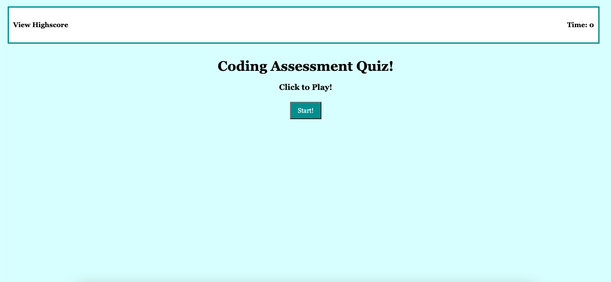

[Link to Coding Assessment Quiz](https://marikadicarlo.github.io/CodingQuiz/)



## Coding Assessment Quiz
This challenge required me to build a timed coding quiz with mulitple choice questions. This application will feature updated HTML and CSS powered by JavaScript code. Users will have 60 seconds to take the quiz. If your answer is correct, you will move forward to the next question. If your answer is incorrect, you will be prompted with an alert message, and move forward to the next question. At the end of the quiz, you will be prompted to enter your initials, and record your score. Highscores can be viewed separately.

For this specific challenge, I had to do a lot of outside research, using Google and YouTube to assist with different functions. I had a lot of difficulty with localStorage and saving the current and previous highscores. I also had a tough time with my timer. It would countdown, but once it reached "0" time, it would go into the negatives. Thankfully, after some research and a tutoring session, I was able to run the code with no issues.

A special thank you to my tutor, Armando, for helping!

## User Story
```
AS A coding boot camp student
I WANT to take a timed quiz on JavaScript fundamentals that stores high scores
SO THAT I can gauge my progress compared to my peers
```

## Acceptance Criteria
```
GIVEN I am taking a code quiz
WHEN I click the start button
THEN a timer starts and I am presented with a question
WHEN I answer a question
THEN I am presented with another question
WHEN I answer a question incorrectly
THEN time is subtracted from the clock
WHEN all questions are answered or the timer reaches 0
THEN the game is over
WHEN the game is over
THEN I can save my initials and score
```

## Resources

Event.stopPropagation()
https://developer.mozilla.org/en-US/docs/Web/API/Event/stopPropagation